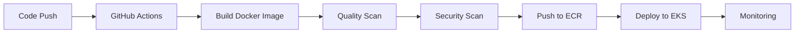

  

<h1 align="center">👋 Hi, I’m @shubhamjain-tech</h1>

<h3 align="center">
🚀 DevOps Engineer | AWS | Docker | Kubernetes | Terraform | CI/CD
</h3>

  

💡 Building scalable cloud infrastructure | ⚙️ Automating deployments | 🔐 DevSecOps Enthusiast  

📍 India | 🎯 Open to DevOps / Cloud Engineer Roles

---

## 🧠 About Me  

✔ Hands-on with **AWS (EKS, EC2, S3, IAM, VPC, RDS, ECR)**  
✔ Containerization & orchestration using **Docker & Kubernetes (EKS, Minikube)**  
✔ CI/CD automation with **GitHub Actions & Jenkins**  
✔ Monitoring & observability using **Prometheus, Grafana & CloudWatch**  
✔ DevSecOps practices using **Trivy & SonarQube**  
✔ Strong in **Linux, Shell Scripting & Server Management**  
✔ Experience with **Nginx, Apache HTTPD & reverse proxy setups**  

📫 **Connect with me:**  
[LinkedIn](https://www.linkedin.com/in/shubham-jain-685520148/) | [Email](mailto:shubhamjain9005@outlook.com)

---

## 📄 Resume  

---

## 🚀 Core Expertise  

- ☁️ AWS Cloud Infrastructure (EKS, EC2, VPC, IAM)  
- ⚙️ CI/CD Automation (GitHub Actions, Jenkins)  
- 🐳 Containerization (Docker, Kubernetes)  
- 📊 Monitoring & Observability (Prometheus, Grafana)  
- 🔐 DevSecOps (Trivy, SonarQube)  

---

## 🧰 Tech Stack

| Category | Tools |
|-----------|--------|
| ☁️ Cloud | AWS (EC2, S3, EKS, RDS, CloudFront, IAM, VPC) |
| 🐳 Containers | Docker, Kubernetes, Minikube |
| ⚙️ Automation | Terraform, Jenkins, GitHub Actions |
| 📊 Monitoring | Prometheus, Grafana, CloudWatch |
| 🌐 Web Servers | Nginx, Apache HTTPD |
| 💾 Databases | PGSQL, MongoDB |
| 💻 OS & CLI | Linux (Ubuntu), Bash scripting |

---

## 🧩 Featured Projects

### 🧠 PROJECT: NATIONAL STOCK EXCHANGE (NSE)

#### Tech Stack: AWS, EKS, Docker, Kubernetes, Terraform, Jenkins, GitHub Actions, Ansible, Prometheus, Grafana, SonarQube, Trivy

Designed and implemented end-to-end CI/CD pipelines using Jenkins & GitHub Actions for microservices deployment
Migrated applications from Docker Compose to Kubernetes (Amazon EKS), improving scalability and availability
Built and optimized Docker images (multi-stage builds) for frontend, backend, and microservices
Implemented Kubernetes Ingress & AWS Load Balancer for efficient traffic routing and high availability
Integrated SonarQube and Trivy scans to enhance code quality and container security
Automated infrastructure provisioning using Terraform and configuration management using Ansible
Managed database migrations using Flyway, ensuring consistent schema deployment
Set up Prometheus & Grafana monitoring for real-time observability and alerting
Automated application configuration and reduced manual intervention using scripting (Bash/Python)
Troubleshot CI/CD pipelines, Kubernetes deployments, and production issues in Linux environments

#### 🚀 Impact
Reduced manual deployment effort by ~70% through CI/CD automation
Improved deployment reliability and release consistency
Achieved high availability and scalability using Kubernetes (EKS)
Enhanced security posture with automated vulnerability and code quality scans
Reduced downtime by proactively monitoring applications and infrastructure

#### 💡 Why this version is better
Combines your real NSE experience + modern tools (EKS, Terraform)
Sounds practical (not copied/template)
Covers:
CI/CD ✅
Containers ✅
Kubernetes ✅
Security ✅
Monitoring ✅
Troubleshooting ✅

---

### 🏗️ AWS Three-Tier Architecture  
- Designed and deployed a secure and scalable **three-tier web app** using AWS services  
- Used **Docker + Kubernetes (EKS)** for container orchestration  
- Automated builds and deployments using **CI/CD pipelines**

### 🔁 Web Hosting Comparison  
- Hosted and compared a website using **Nginx** and **Apache HTTPD**  
- Configured **Nginx** as a reverse proxy and **Apache** for dynamic content

---
## 🌱 Currently Learning  

- Advanced Kubernetes (Helm, HPA)  
- GitOps (ArgoCD)  
- Cloud Security & DevSecOps practices  
---

## 📈 GitHub Analytics  

  

---

## 🏆 Trophies  

---

## 🛠️ Badges  

---
## ⚙️ CI/CD Pipeline Flow  

  

---

## 📊 Activity Graph  

---

## 👀 Visitor Counter  

---

## 💬 Daily DevOps Quote  

<!---
shubhamjain-tech/shubhamjain-tech is a ✨ special ✨ repository because its `README.md` (this file) appears on your GitHub profile.
You can click the Preview link to take a look at your changes.
--->
